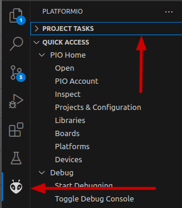

# PLATFORMIO MULTIPLATAFORMA

## Guia de Configuração

### 1. Criar o Projeto base

O primmeiro passo para a confugração é criar o projeto que vai servir de base, pode ser um projeto para qualquer placa que vai ser usada. 

No meu exemplo criei um projeto para o STM32 Bluepill, o projeto virá com um arquivo `platformio.ini` previamente configurado: 

### 2. Inserir as configurações da segunda placa

Agora você precisa inserir as configurações da segunda placa, pode encontrar como configurar com uma pesquisa rapida na internet ou, de forma alternativa, criando um segundo projeto em outra pasta apenas para copiar o conteudo do arquivo `platformio.ini`. 

Aqui inseri no arquivo as configurações de uma placa arduino:

**Certifique-se de que o nome do ambiente, flag `env` apontada pela seta, é diferente na configuração das duas placas**

### 3. Arquivo Completo

Agora esse é o meu arquivo `platformio.ini` completo:

Note que no topo do arquivo onde é apontado pela seta eu criei um `env` sem nome e coloquei a especificação do framework, isso por que as duas configurações usam o mesmo framework. Ou seja, tudo que for igual nas duas configurações eu posso especificar apenas uma vez nessa seção.

### 4. Compilando cada placa

Para compilar ou fazer upload agora precisamos dizer para qual plataforma queremos que a tarefa seja executada.

Para isso acessamos o menu do platformio e expandimos a opção `PROJECT TASKS`

Dentro da opção `PROJECT TASKS` teremos opções parecidas com essa:

Apontado pelas setas vermelhas as duas plataformas que configuramos, mostrando o mesmo nome que atribuímos na flag `env`.

Expandindo a opção da plataforma tem as opções de build e upload para aquela plataforma apontado pela seta verde e algumas outras como monitor serial.

### 5. Tratando diferenças de codigo

Diferentes plataformas podem ter diferentes formas de realizar alguma função ou usar bibliotecas diferentes, isso pode ser resolvido com definição de macros.

#### 5.1. Macros
Dentro de cada enviroment eu adicionei uma `build_falg` para criar um macro na compilação, é importante que o nome dos macros sejam **DIFERENTES** para cada placa, pois vão ser usados para diferenciar o código.

#### 5.2. Verificação no código

Veja nesses dois exemplos de código, em toda parte que eu tiver uma diferença eu coloco uma verificação usando as macros que criamos no `platformio.ini`.

Dessa forma podemos fazer um codigo inteiro que funcione para as duas placas e tratar apenas pequenas diferenças entre as plataformas.

<table  align="center" style="border:none !important">
    <tr style="border:none !important">
    <td style="border:none !important">
        

    </td>
    <td style="border:none !important">
        

    </td>
    </tr>
</table>

Note nesse exemplo da função loop que a verificação da macro foi inserida no meio do código, ela pode ser inserida em qualquer lugar pois atrapalhará a execução, serve para dizer ao compilador qual trecho de código usar na compilação.

~~~
void loop() {
  digitalWrite(LED, HIGH);
  delay(500);
  digitalWrite(LED, LOW);
  delay(500);

  #ifdef BUILD_ARDUINO
  analogWrite(A0, 255);
  #elif BUILD_BLUEPILL
  pwmWrite(PA0, 65535);
  #endif
}
~~~

***VER O CODIGO FONTE [main.cpp](./src/main.cpp) PARA OUTROS EXEMPLOS DE USO DO IFDEF*

### 6. Final 

Como mostra o gif eu consigo compilar para as duas placas sem problemas:

